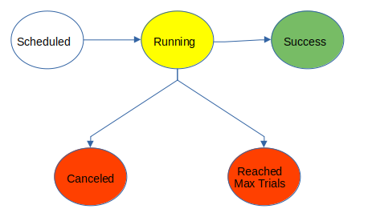

# Irrigation System #
## Irrigation Jobs ##

An irrigation job starts when a sensor opens a water valve. There are five lifecycle states, and we record all state changes
in the JOB_STATUS table.



### Irrigation Job States ###

1. Scheduled (Initial State): The job was just created but has not started yet.
2. Running: The job is on its way.
3. Success (Ending State): Completed without problems.
4. Canceled (Ending State): Abruptly stopped by job scheduler.
5. Reached Max Trials (Ending State): The system stopped trying to start the job.

### System Requirement for Running Tests ###

1. Latest maven version.
2. JDK 11+

### How to Run Tests ###

Clone this repository and then move to the source folder
create by git and run the following CLI command

```
$ mvn test -Dtest=JobPoolControllerTest
```

## Sample Execution Log ##
```
com.andela.irrigation.service.job.Job    : Starting job for sensor #6.
com.andela.irrigation.service.job.Job    : Starting job for sensor #3.
com.andela.irrigation.service.job.Job    : Starting job for sensor #0.
com.andela.irrigation.service.job.Job    : Starting job for sensor #1.
com.andela.irrigation.service.job.Job    : Starting job for sensor #2.
com.andela.irrigation.service.job.Job    : Starting job for sensor #7.
com.andela.irrigation.service.job.Job    : Starting job for sensor #5.
com.andela.irrigation.service.job.Job    : Starting job for sensor #4.
com.andela.irrigation.service.job.Job    : Job for sensor #7 finished 'REACHED_MAX_TRIALS' status.
com.andela.irrigation.service.job.Job    : Job for sensor #2 finished 'REACHED_MAX_TRIALS' status.
com.andela.irrigation.service.job.Job    : Job for sensor #6 finished 'SUCCESS' status.
com.andela.irrigation.service.job.Job    : Job for sensor #5 finished 'SUCCESS' status.
com.andela.irrigation.service.job.Job    : Job for sensor #4 finished 'SUCCESS' status.
com.andela.irrigation.service.job.Job    : Job for sensor #1 finished 'REACHED_MAX_TRIALS' status.
com.andela.irrigation.service.job.Job    : Job for sensor #0 finished 'REACHED_MAX_TRIALS' status.
com.andela.irrigation.service.job.Job    : Job for sensor #3 finished 'REACHED_MAX_TRIALS' status.
com.andela.irrigation.service.job.Job    : Starting job for sensor #8.
com.andela.irrigation.service.job.Job    : Starting job for sensor #9.
com.andela.irrigation.service.job.Job    : Job for sensor #8 finished 'SUCCESS' status.
com.andela.irrigation.service.job.Job    : Job for sensor #9 finished 'SUCCESS' status.
com.andela.irrigation.service.job.Job    : Starting job for sensor #10.
com.andela.irrigation.service.job.Job    : Starting job for sensor #11.
com.andela.irrigation.service.job.Job    : Starting job for sensor #12.
com.andela.irrigation.service.job.Job    : Starting job for sensor #13.
com.andela.irrigation.service.job.Job    : Job for sensor #11 finished 'SUCCESS' status.
com.andela.irrigation.service.job.Job    : Job for sensor #12 finished 'REACHED_MAX_TRIALS' status.
com.andela.irrigation.service.job.Job    : Job for sensor #10 finished 'SUCCESS' status.
com.andela.irrigation.service.job.Job    : Job for sensor #13 finished 'SUCCESS' status.
com.andela.irrigation.service.job.Job    : Starting job for sensor #14.
com.andela.irrigation.service.job.Job    : Starting job for sensor #16.
com.andela.irrigation.service.job.Job    : Starting job for sensor #15.
com.andela.irrigation.service.job.Job    : Starting job for sensor #17.
com.andela.irrigation.service.job.Job    : Starting job for sensor #20.
com.andela.irrigation.service.job.Job    : Starting job for sensor #18.
com.andela.irrigation.service.job.Job    : Starting job for sensor #19.
com.andela.irrigation.service.job.Job    : Job for sensor #15 finished 'SUCCESS' status.
com.andela.irrigation.service.job.Job    : Job for sensor #19 finished 'SUCCESS' status.
com.andela.irrigation.service.job.Job    : Job for sensor #16 finished 'REACHED_MAX_TRIALS' status.
com.andela.irrigation.service.job.Job    : Job for sensor #20 finished 'SUCCESS' status.
com.andela.irrigation.service.job.Job    : Job for sensor #18 finished 'SUCCESS' status.
com.andela.irrigation.service.job.Job    : Job for sensor #14 finished 'REACHED_MAX_TRIALS' status.
com.andela.irrigation.service.job.Job    : Job for sensor #17 finished 'REACHED_MAX_TRIALS' status.
```
## Data Model ##
### Plot of Land ###
A plot of land is a cultivated area that need daily irrigation on specific times. We assumed that these plots 
are located in a dry area. 
```
CREATE TABLE PLOT (
ID BIGINT GENERATED ALWAYS AS IDENTITY PRIMARY KEY,
AREA NUMERIC(12,2) NOT NULL,
PLOT_NAME VARCHAR(64) NOT NULL,
IRRIGATION_TIME DATETIME NOT NULL,
AMOUNT NUMERIC(12, 2) NOT NULL,
CONSTRAINT PLOT_UQ1 UNIQUE(PLOT_NAME)
);
```

### Sensor ###
A sensor is an IOT device deployed on a plot of land. At scheduled times, they open water valves to start
the irrigation process.
```
CREATE TABLE SENSOR (
ID BIGINT GENERATED ALWAYS AS IDENTITY PRIMARY KEY,
PLOT_ID BIGINT NOT NULL,
CONSTRAINT SENSOR_FK1 FOREIGN KEY (PLOT_ID) REFERENCES PLOT(ID)
);
```
### Job Status ###

This table is a log that records irrigation job lifecycle. The next state diagram depicts jobs lifecycle:

```
CREATE TABLE JOB_STATUS (
ID VARCHAR(64) NOT NULL,
SENSOR_ID BIGINT NOT NULL,
START_TIME DATETIME NOT NULL,
END_TIME DATETIME,
TRIALS INT NOT NULL,
JOB_STATUS_CODE VARCHAR(64) NOT NULL,
CONSTRAINT JOB_PK PRIMARY KEY (ID),
CONSTRAINT JOB_PK_1 FOREIGN KEY (SENSOR_ID) REFERENCES SENSOR(ID)
)
```

